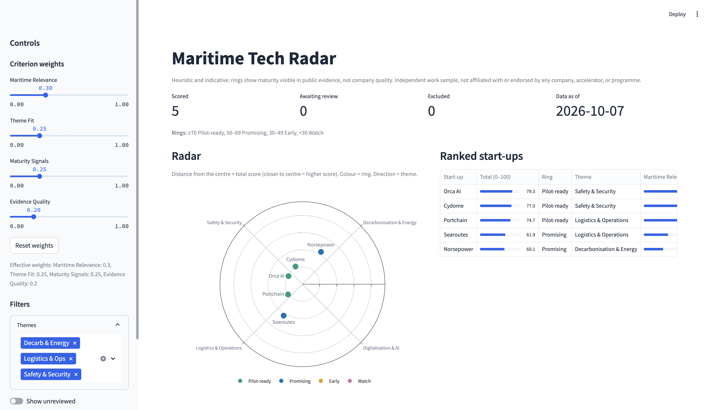
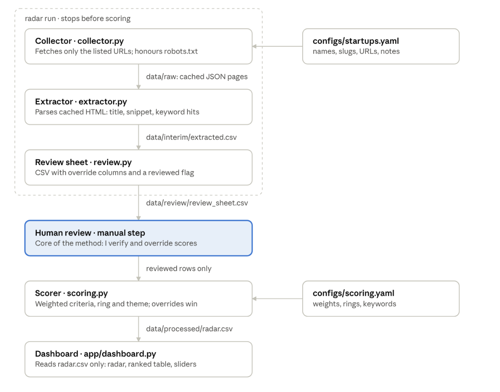

# Maritime Tech Radar

[](https://github.com/sachaloeb/MaritimeTechRadar/actions)

A reproducible, human-reviewed technology radar for maritime and port-tech start-ups. It turns a few public web pages per company into a ranked, auditable view: a radar, a ranked table, and the reasons behind every score.

**Status:** real data, n = 5 start-ups. Independent work sample. Scores are indicative, not verdicts.


<sub>Rings show maturity visible in public evidence, not company quality.</sub>

## Problem

Scouting young companies is slow because the evidence sits on scattered web pages and every comparison is rebuilt by hand. Quick comparisons usually fail in one of two ways. Either they are **opaque** (a score with no sources behind it) or they are **unstructured** (a slide nobody can re-run when a company changes).

This project asks whether a small, transparent pipeline with a human review step can turn public pages into a ranked view that is fast enough to use in a scouting conversation and honest about where its evidence runs thin.

## Research questions

With 5 to 8 start-ups these questions are exploratory: I report counts and rank changes, not statistical claims.

| # | Question | Measured by |
|---|---|---|
| RQ1 | **Evidence coverage.** Which criteria can public pages support well, and which stay thin? | Evidence-quality score; share of scores corrected by hand, per criterion |
| RQ2 | **Effect of human review.** How much does review change the outcome compared with automatic scoring alone? | Share of scores overridden; Spearman ρ between automatic and reviewed rankings; ring changes |
| RQ3 | **Sensitivity to weights.** How stable is the ranking when the weights move? | Rank and ring changes when each weight shifts by ±0.10 (others rescaled) |
| RQ4 | **Cost of keeping it current.** What does a refresh take? | Review minutes per start-up; failed or blocked pages; whether an offline re-run is identical |

The answers are generated from the data. See [Results](#results).

## How it works

A one-way pipeline with one manual gate. Scripts collect and extract, a person reviews every row, and only reviewed rows are scored.



| Step | Command | What it does |
|---|---|---|
| Collect | `radar collect` | Fetches only the URLs in the config (no crawling). Honours robots.txt, waits 2 s per host, times out after 15 s with at most 2 retries, sends an identifying User-Agent, and never fetches denylisted sites (LinkedIn, Crunchbase, etc.). Each page is cached with its URL, fetch time, HTTP status and content hash, and is never re-fetched without `--refresh`. |
| Extract | `radar extract` | Takes the title, meta description and visible text, then counts distinct whole-word keyword matches per criterion and per theme. Matches are unioned across a start-up's pages, so repetition does not inflate scores. |
| Review sheet | `radar review-sheet` | Writes a CSV with the extracted evidence plus empty reviewer columns. On a re-run it merges by slug and keeps the reviewer's work, with a timestamped backup. |
| **Review** | *(manual)* | I check each row against the source pages. I override a criterion score (0 to 5) or the theme where the keywords misread the page, write a note, record the minutes spent, and set `reviewed = true`, or exclude the row with a reason. |
| Score | `radar score` | Scores reviewed rows only. Overrides win. |
| Analyse | `radar analyse` | Computes RQ1 to RQ4 and writes `reports/` and the Results block below. |

## Scoring

Each criterion is scored 0 to 5 from keyword hits, capped at a saturation point. The total is a weighted sum scaled to 100.

`s_i = min(5, 5 × hits_i / saturation_i)`  `total = 100 × Σ w_i × s_i / 5`

| Criterion | Weight | Saturation | What counts |
|---|---|---|---|
| Maritime relevance | 0.30 | 10 | Port, maritime and shipping context on the pages |
| Theme fit | 0.25 | 8 | Hits for the best-matching theme's keyword list |
| Maturity signals | 0.25 | 6 | Pilot, customer, deployed, partnership, funding and contract mentions |
| Evidence quality | 0.20 | 6 | Distinct source pages (deduplicated by content hash) plus distinct evidence keywords (case study, report, etc.) |

- **Rings:** Pilot-ready ≥ 70, Promising 50 to 69, Early 30 to 49, Watch < 30.
- **Themes:** Decarbonisation & Energy, Digitalisation & AI, Logistics & Operations, Safety & Security. A start-up takes the theme with the most keyword hits (ties go to the alphabetically first), unless the reviewer overrides it.
- **Overrides:** a reviewer's score or theme always wins and is listed in `overridden_fields`.

The themes are illustrative defaults loosely based on publicly described port-innovation focus areas. Weights, saturation points, keywords, rings and themes all live in [`configs/scoring.yaml`](configs/scoring.yaml), so the radar can be pointed at other themes without code changes. There is no LLM or ML model in the scoring path.

## Selection rule

The rule was fixed before any scoring. A start-up must:
- work in maritime or port technology;
- have an English public website with at least 2 usable public pages;

The set should also mix the four themes. The five start-ups and their URLs are in [`configs/startups.yaml`](configs/startups.yaml).

## Quick start

```bash
# Requires Python 3.11+ and uv
make install
make app          # dashboard on the committed real data: http://localhost:8501
```

Try the whole pipeline on synthetic data. No network is needed, and a red banner marks the data as demo.

```bash
make demo && make demo-app
```

Reproduce the published radar from the page cache. This is offline and deterministic.

```bash
make reproduce    # radar run --offline && radar score
make analyse      # regenerates reports/ and the Results block below
```

To refresh real data, edit `configs/startups.yaml`, run `make run`, review `data/review/review_sheet.csv` (see the Review step above), then `make reproduce` and `make analyse`.

## Results

<!-- SNAPSHOT:START --> n=5, dataset: real <!-- SNAPSHOT:END -->

<!-- RESULTS:START -->


Exploratory analysis only, sample size is too small for statistical claims.

### Key findings

- **RQ1 Evidence coverage:** maritime relevance and theme fit needed no correction (0/5 overridden); maturity signals (3/5) and evidence quality (2/5) were thin, with mean scores moving 1.83 → 3.43 and 2.67 → 3.23 after review.
- **RQ2 Review effect:** 5 of 20 criterion scores (25%) and 2 of 5 themes overridden; Spearman ρ = 0.9000 between automatic and reviewed rankings; 3 of 5 start-ups changed ring.
- **RQ3 Weight sensitivity:** 2 of 8 ±0.10 weight shifts change the order (max shift 1 place); 0 ring changes.
- **RQ4 Refresh cost:** 63 review minutes in total (12.6 per start-up); 0 failed or blocked pages; offline re-run identical (extracted + radar).

### RQ1: Coverage

| criterion | share_overridden | mean_auto_score | mean_reviewed_score |
| --- | --- | --- | --- |
| maritime_relevance | 0.0 | 3.0 | 3.0 |
| theme_fit | 0.0 | 4.5 | 4.5 |
| maturity_signals | 0.6 | 1.8333 | 3.4333 |
| evidence_quality | 0.4 | 2.6667 | 3.2333 |
| theme | 0.4 |  |  |

### RQ2: Review effect

| slug | auto_score | reviewed_score | auto_ring | reviewed_ring | ring_changed | auto_rank | reviewed_rank | rank_change | spearman_rho |
| --- | --- | --- | --- | --- | --- | --- | --- | --- | --- |
| orca-ai | 79.33 | 79.33 | Pilot-ready | Pilot-ready | False | 1.0 | 1.0 | 0 | 0.9000 |
| cydome | 60.17 | 77.0 | Promising | Pilot-ready | True | 3.0 | 2.0 | 1 | 0.9000 |
| portchain | 69.33 | 74.67 | Promising | Pilot-ready | True | 2.0 | 3.0 | -1 | 0.9000 |
| searoutes | 51.04 | 61.88 | Promising | Promising | False | 4.0 | 4.0 | 0 | 0.9000 |
| norsepower | 41.79 | 60.13 | Early | Promising | True | 5.0 | 5.0 | 0 | 0.9000 |

### RQ3: Weight sensitivity

| criterion | delta | new_weight | clipped | rank_changes | max_rank_shift | ring_changes | spearman_vs_baseline |
| --- | --- | --- | --- | --- | --- | --- | --- |
| maritime_relevance | -0.1 | 0.2 | False | 0 | 0 | 0 | 1.0000 |
| maritime_relevance | 0.1 | 0.4 | False | 0 | 0 | 0 | 1.0000 |
| theme_fit | -0.1 | 0.15 | False | 2 | 1 | 0 | 0.9000 |
| theme_fit | 0.1 | 0.35 | False | 0 | 0 | 0 | 1.0000 |
| maturity_signals | -0.1 | 0.15 | False | 0 | 0 | 0 | 1.0000 |
| maturity_signals | 0.1 | 0.35 | False | 2 | 1 | 0 | 0.9000 |
| evidence_quality | -0.1 | 0.1 | False | 0 | 0 | 0 | 1.0000 |
| evidence_quality | 0.1 | 0.3 | False | 0 | 0 | 0 | 1.0000 |
| SUMMARY |  |  |  | 2 |  | 0 | 2/8 scenarios with rank change |

### RQ4: Refresh cost

| metric | value |
| --- | --- |
| total_review_minutes | 63 |
| mean_review_minutes | 12.6 |
| median_review_minutes | 12.0 |
| pages_cache_hit | 10 |
| pages_failed_or_blocked | 0 |
| pages_usable_total | 10 |
| reproducibility | identical (extracted + radar) |
| extracted_csv_hash | 34db653d40170284 |
| radar_csv_hash | 1abe57ae6462800c |

<!-- RESULTS:END -->

## Limitations

- **Keyword scoring is a first pass, not a judgement.** Matching is context-blind: menu labels, footers and staff bios can match, and testimonials, installed-base figures or certifications often do not. The review step exists for exactly this.
- **Small sample** (n = 5): exploratory only, no statistical claims.
- **Public pages only**, as of the retrieval dates shown. The radar is a snapshot, not a forecast.
- **The weights, saturation points and ring thresholds are declared assumptions, not calibrated values.** RQ3 shows how much they matter.
- **The scores and criteria are my own.** They do not reflect any organisation's selection criteria.

## Provenance

Every score on the dashboard links to its source pages and retrieval dates. Raw page caches stay local (`data/raw/` is gitignored). Their URLs, fetch times, HTTP status and content hashes are tracked in [`data/raw/MANIFEST.csv`](data/raw/MANIFEST.csv). Synthetic test data is labelled `dataset_kind = "demo"` and shown under a red banner.

## Development

```bash
make check        # ruff + pytest (all offline, network blocked)
make status       # per-start-up pipeline status
make validate     # sanity checks on review sheet and radar.csv
```

The dashboard needs only `data/processed/radar.csv` (path overridable with `RADAR_CSV`), so it runs without scraping:
`streamlit run app/dashboard.py --server.headless true`.

<details>
<summary>Column reference</summary>

| Column | Meaning |
|---|---|
| `*_hits` | Count of distinct keywords matched for a criterion or theme |
| `*_matched` | The matched keywords, pipe-separated (the audit trail) |
| `evidence_quality_pages` | Usable pages, deduplicated by content hash |
| `evidence_quality_hits` | `evidence_quality_pages` + distinct evidence keywords |
| `*_override` | Reviewer score (0 to 5) for a criterion, or a theme id for `theme_override` |
| `notes` | Reviewer's reason for overrides and judgements |
| `reviewed` / `excluded` / `exclusion_reason` | Review gate; only reviewed, non-excluded rows are scored |
| `review_minutes` | Time spent reviewing the start-up (used in RQ4) |
| `overridden_fields` | Which fields the reviewer changed (radar.csv) |

</details>

## Non-affiliation

Independent work sample by Sacha Loeb. It is not affiliated with or endorsed by any company shown.

## License

MIT
