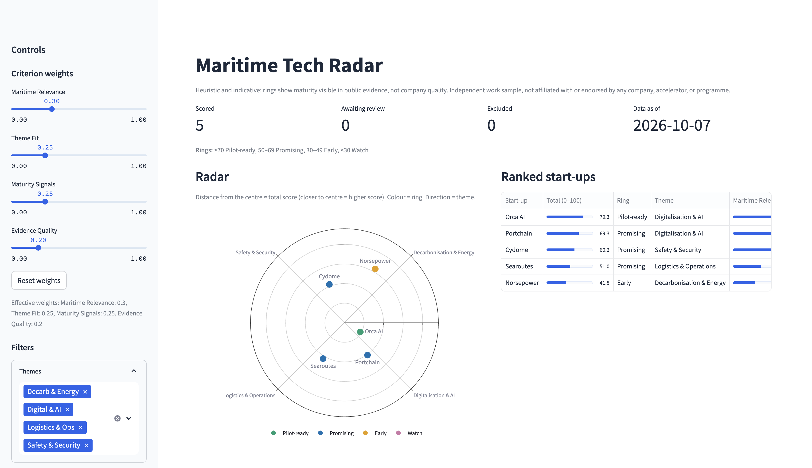

# Maritime Tech Radar

[](https://github.com/sachaloeb/MaritimeTechRadar/actions)

A config-driven pipeline and single-page Streamlit dashboard that ranks a handful of public maritime/port-tech start-ups on a technology radar. Built as an independent work sample for a Data & Research internship.



## Quick start

```bash
# Requires Python 3.11+ and uv
make install

# Run the pipeline on synthetic data and open the dashboard
make demo
make demo-app          # opens http://localhost:8501
```

## Real-data workflow

1. **Configure start-ups** in `configs/startups.yaml` (5-8 entries, 1-3 URLs each).

2. **Collect and extract:**
   ```bash
   make run               # fetches pages, extracts features, writes review sheet
   ```
   The collector respects `robots.txt`, enforces a 2 s/host rate limit, and skips denylisted domains.

3. **Human review:** open `data/review/review_sheet.csv` in any spreadsheet editor.
   - Verify each row's extracted data against the source URL.
   - Optionally set score overrides (`maritime_relevance_override`, etc.) or `theme_override`.
   - Record `review_minutes` and any `notes`.
   - Mark `reviewed = true` for each approved row; mark unwanted rows `excluded = true` with an `exclusion_reason`.

4. **Score and view:**
   ```bash
   make reproduce         # re-extract from cache + score (offline, deterministic)
   make app               # dashboard at http://localhost:8501
   ```

5. **Analyse:**
   ```bash
   make analyse           # writes reports/results.md and per-RQ CSVs
   ```

## Selection rule

Start-ups are selected before any scoring, using a fixed rule: the company must be public, independent, operating in maritime or port technology, have at least one working English-language URL, and not appear in a current accelerator cohort. The seed list in `configs/startups.yaml` was verified on 2026-10-07.

## Scoring method

Each start-up is scored on four criteria (0-5 each), weighted and summed to a total (0-100):

| Criterion | Weight | Method |
|-----------|--------|--------|
| Maritime Relevance | 0.30 | Whole-word keyword hits |
| Theme Fit | 0.25 | Derived from best quadrant keyword hits |
| Maturity Signals | 0.25 | Whole-word keyword hits |
| Evidence Quality | 0.20 | `evidence_quality_pages` (distinct pages) + distinct evidence keyword hits |

`total = 100 * sum(w_i * s_i / 5)` where `s_i = min(5, 5 * hits / saturation)`.

**Rings** (from `configs/scoring.yaml`): >=70 Pilot-ready, 50-69 Promising, 30-49 Early, <30 Watch.

**Themes (quadrants):** Decarbonisation & Energy, Digitalisation & AI, Logistics & Operations, Safety & Security. Assigned by highest quadrant keyword count; ties go alphabetically. Themes are configurable in `configs/scoring.yaml`.

Reviewer overrides always take precedence over automatic scores. All scoring parameters, keywords, weights, and saturation values are editable in `configs/scoring.yaml`.

## Limitations

- **Heuristic keyword scoring** is not a substitute for expert evaluation.
- **Small sample size** (n=5-8): results are exploratory, not statistically significant.
- **Public sources only**: no proprietary databases or login-walled content.
- **Context-blind matching**: navigation labels, footers, and bios can produce false positives.
- **Point-in-time snapshot**: data is only as current as the last fetch.
- Scoring is deterministic and rule-based; no LLM or ML model is involved.

## Data provenance

Every fact shown in the dashboard carries the source URL it was extracted from, the date it was fetched, and whether it was human-reviewed. Raw cached pages are stored in `data/raw/` (gitignored); provenance metadata is tracked in `data/raw/MANIFEST.csv`. Test fixtures use synthetic HTML and are labelled `dataset_kind="demo"` with a prominent banner.

## Development

```bash
make test              # pytest (142 tests, all offline)
make lint              # ruff (E, F, W, I)
make check             # lint + test in one step
make status            # per-start-up pipeline status
make bench             # timing benchmark (determinism tests)
```

## Deployment

The dashboard only needs `data/processed/radar.csv` to run:

```bash
streamlit run app/dashboard.py --server.headless true
```

Set `RADAR_CSV` to point to a different file if needed.

## Columns

Key columns produced by the pipeline and used in the review sheet / radar.csv:

| Column | Description |
|--------|-------------|
| `evidence_quality_hits` | Evidence quality hits (distinct pages + distinct keywords) |
| `evidence_quality_pages` | Count of deduplicated (by content hash) usable pages |
| `evidence_quality_matched` | Pipe-separated evidence keywords matched (e.g. `case study\|report`) |
| `maritime_relevance_hits` | Count of distinct maritime relevance keywords matched |
| `maritime_relevance_matched` | Pipe-separated maritime relevance keywords matched |
| `theme_fit_hits` | Best-quadrant keyword count (derived from highest quadrant score) |
| `maturity_signals_hits` | Count of distinct maturity signal keywords matched |
| `*_matched` | Pipe-separated matched keywords for the corresponding criterion or quadrant |
| `*_override` | Reviewer override for criterion score (numeric 0–5) or theme (quadrant key) |

`evidence_quality_hits = evidence_quality_pages + len(evidence_quality_matched.split("\|"))`.
This rewards breadth (independent public pages) and proof-type language, not repetition.

## Non-affiliation

This project is an independent work sample. It is not affiliated with, endorsed by, or produced for any company, accelerator, or programme.

<!-- SNAPSHOT:START --> n=5, data as of 2026-10-07T18:02:11.406461+00:00, dataset: real <!-- SNAPSHOT:END -->

<!-- RESULTS:START -->

# Results (Real data, n=5)

Data as of: 2026-10-07T18:02:11.406461+00:00. Exploratory analysis only — sample size is too small for statistical claims.

## RQ1: Coverage

| criterion | share_overridden | mean_auto_score | mean_reviewed_score |
| --- | --- | --- | --- |
| maritime_relevance | 0.0 | 3.0 | 3.0 |
| theme_fit | 0.0 | 4.5 | 4.5 |
| maturity_signals | 0.6 | 1.8333 | 3.4333 |
| evidence_quality | 0.4 | 2.6667 | 3.2333 |
| theme | 0.4 |  |  |

## RQ2: Review effect

| slug | auto_score | reviewed_score | auto_ring | reviewed_ring | ring_changed | auto_rank | reviewed_rank | rank_change | spearman_rho |
| --- | --- | --- | --- | --- | --- | --- | --- | --- | --- |
| orca-ai | 79.33 | 79.33 | Pilot-ready | Pilot-ready | False | 1.0 | 1.0 | 0 | 0.9000 |
| cydome | 60.17 | 77.0 | Promising | Pilot-ready | True | 3.0 | 2.0 | 1 | 0.9000 |
| portchain | 69.33 | 74.67 | Promising | Pilot-ready | True | 2.0 | 3.0 | -1 | 0.9000 |
| searoutes | 51.04 | 61.88 | Promising | Promising | False | 4.0 | 4.0 | 0 | 0.9000 |
| norsepower | 41.79 | 60.13 | Early | Promising | True | 5.0 | 5.0 | 0 | 0.9000 |

## RQ3: Weight sensitivity

| criterion | delta | new_weight | clipped | rank_changes | max_rank_shift | ring_changes | spearman_vs_baseline |
| --- | --- | --- | --- | --- | --- | --- | --- |
| maritime_relevance | -0.1 | 0.2 | False | 0 | 0 | 0 | 1.0000 |
| maritime_relevance | 0.1 | 0.4 | False | 0 | 0 | 0 | 1.0000 |
| theme_fit | -0.1 | 0.15 | False | 2 | 1 | 0 | 0.9000 |
| theme_fit | 0.1 | 0.35 | False | 0 | 0 | 0 | 1.0000 |
| maturity_signals | -0.1 | 0.15 | False | 0 | 0 | 0 | 1.0000 |
| maturity_signals | 0.1 | 0.35 | False | 2 | 1 | 0 | 0.9000 |
| evidence_quality | -0.1 | 0.1 | False | 0 | 0 | 0 | 1.0000 |
| evidence_quality | 0.1 | 0.3 | False | 0 | 0 | 0 | 1.0000 |
| SUMMARY |  |  |  | 2 |  | 0 | 2/8 scenarios with rank change |

## RQ4: Refresh cost

| metric | value |
| --- | --- |
| mean_review_minutes | 12.6 |
| median_review_minutes | 12.0 |
| pages_cache_hit | 10 |
| pages_failed_or_blocked | 0 |
| pages_usable_total | 10 |
| reproducibility | identical (extracted + radar) |
| extracted_csv_hash | 34db653d40170284 |
| radar_csv_hash | 2ab36e525cd4944a |

## Limitations

- Keyword matching is context-blind: navigation labels, footers and bios can match.
- theme_fit saturates quickly from a single quadrant.
- Maturity vocabulary is narrow.
- Human overrides exist for exactly this reason.
- Sample size is exploratory (n=5-8), no statistical power.

<!-- RESULTS:END -->

## License

MIT
